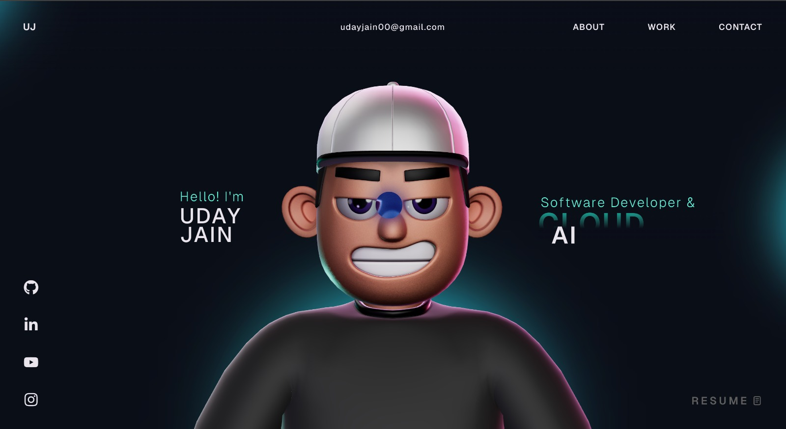

# Uday Jain — 3D Portfolio

A personal portfolio website featuring an interactive 3D character, scroll-driven animations, and physics-based tech stack visualizations. Built with React, TypeScript, Three.js, and GSAP.

Live site: [https://udayjain.vercel.app/](https://udayjain.vercel.app/)



## Table of Contents

- [Features](#features)
- [Tech Stack](#tech-stack)
- [Project Structure](#project-structure)
- [Getting Started](#getting-started)
- [Available Scripts](#available-scripts)
- [GSAP License Note](#gsap-license-note)
- [Deployment](#deployment)
- [License](#license)

## Features

- Interactive 3D character with scroll-driven animations and camera transitions.
- Physics-based tech stack spheres using React Three Fiber and Rapier.
- Featured project hero card with 3D tilt effect and glow tracking.
- Research papers grid with hover animations and counter effects.
- Glowing divider with pulse animation between sections.
- Custom cursor, smooth scrolling, and responsive design.

## Tech Stack

### Core

- React 18
- TypeScript
- Vite

### Animation and 3D

- GSAP + `@gsap/react`
- Three.js
- `@react-three/fiber`
- `@react-three/drei`
- `@react-three/postprocessing`
- `@react-three/cannon`
- `@react-three/rapier`

### Supporting Libraries

- `react-icons`
- `react-fast-marquee`
- `@vercel/analytics`

## Project Structure

```text
.
├── public/                    # Static assets
├── src/
│   ├── assets/                # Local media/assets
│   ├── components/
│   │   ├── Character/         # 3D scene + character logic/utilities
│   │   ├── styles/            # Section/component CSS files
│   │   ├── About.tsx
│   │   ├── Career.tsx
│   │   ├── Contact.tsx
│   │   ├── Landing.tsx
│   │   ├── MainContainer.tsx  # Main page composition
│   │   ├── Navbar.tsx
│   │   ├── TechStack.tsx
│   │   ├── WhatIDo.tsx
│   │   └── Work.tsx
│   ├── context/               # Global providers (loading state, etc.)
│   ├── data/                  # Static data/content definitions
│   ├── App.tsx
│   └── main.tsx
├── package.json
└── vite.config.ts
```

## Getting Started

### Prerequisites

- Node.js 18+ (recommended)
- npm 9+ (or compatible)

### Installation

1. Clone the repository:

   ```bash
   git clone git@github.com:udayjainn/resume.git
   cd resume
   ```

2. Install dependencies:

   ```bash
   npm install
   ```

3. Start the local development server:

   ```bash
   npm run dev
   ```

4. Open the URL shown in the terminal (typically `http://localhost:5173`).

## Available Scripts

- `npm run dev`  
  Starts Vite dev server and exposes host for local network testing.

- `npm run build`  
  Type-checks and builds a production-ready bundle.

- `npm run preview`  
  Serves the production build locally for verification.

- `npm run lint`  
  Runs ESLint checks across the project.

## GSAP License Note

This project uses the standard `gsap` package, including bonus plugins now available in the core package.

- Install dependencies with `npm install`.
- If migrating from older setups, remove `gsap-trial` from your project.

Read official installation guidance here: [GSAP Installation Docs](https://gsap.com/docs/v3/Installation/)

## Deployment

1. Create a production build:

   ```bash
   npm run build
   ```

2. Validate locally:

   ```bash
   npm run preview
   ```

3. Deploy the generated `dist/` folder to your hosting provider (for example Vercel, Netlify, or Cloudflare Pages).

## License

This project is open source and available under the [MIT License](LICENSE).
